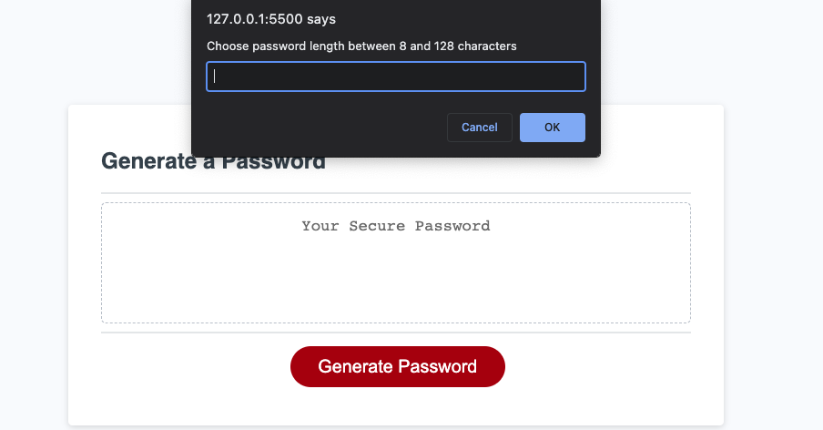
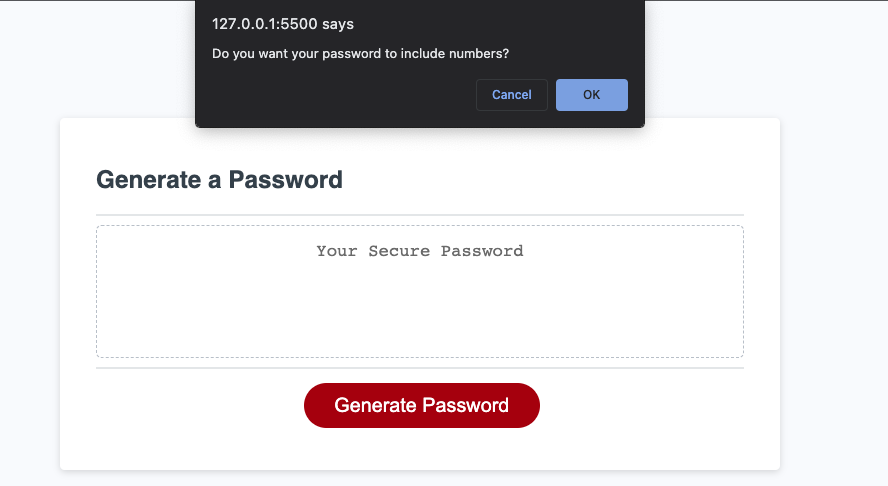
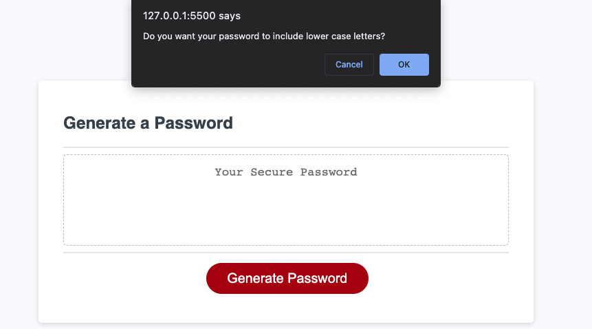
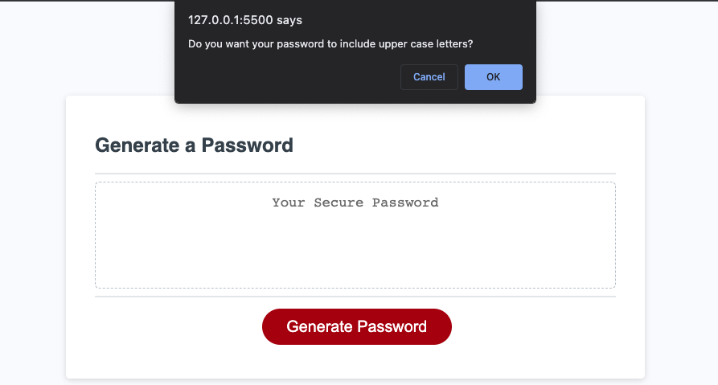

# Javascript-Password-Generator
Password Generator to provide secure passwords for sensitive data/information.

## Description

This project is a javascript password generator that was built to be able to provide security using a randomly generated password. HTML was used as the structure of the build, CSS was used to add style to the generator and Javascript was used to program the the webiste using specific criterias.

Specific Criterias include:
* Character length of 8-128 characters
* Lowercase
* Uppercase 
* Numeric 
* and/or special character types

### Links

[Link to the deployed website](https://luudonny.github.io/Javascript-Password-Generator/)
[Link to the code repository](https://github.com/luudonny/Javascript-Password-Generator)

## Installation

N/A

## Usage

1. Open password generator link in browser
2. Click "Generate Password" button and follow prompts to create random password

The following screenshots will provide example of Password Generator in use:

## Credits
N/A

## License
Please refer to the LICENSE in the repo.